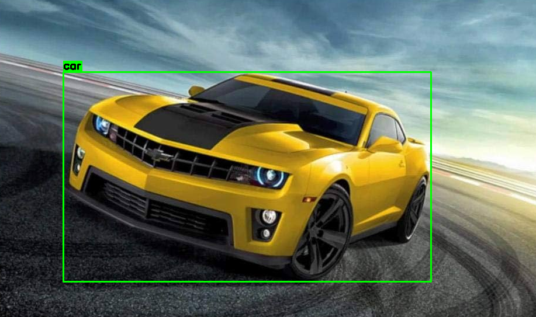
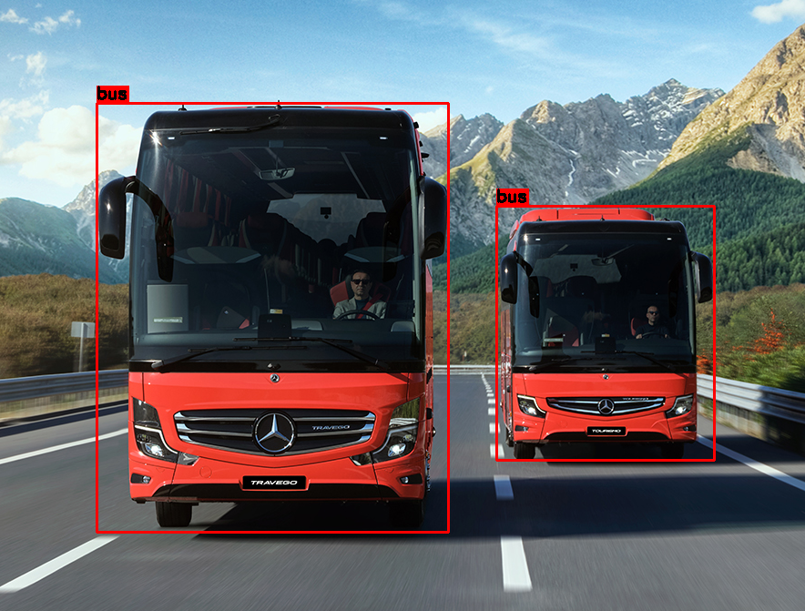
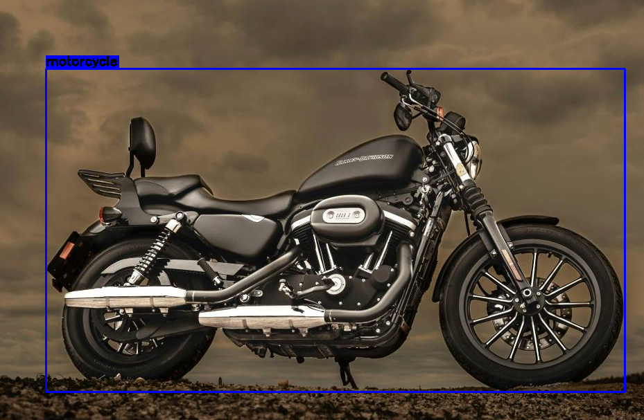

# 🚗 Araç Türü Tespit Sistemi

Bu proje, Ultralytics YOLOv8 modelini kullanarak kamera veya görsellerdeki taşıt türlerini (araba, otobüs, motosiklet, kamyon, bisiklet) tespit eden bir gerçek zamanlı yapay zekâ uygulamasıdır. Görseller arası geçiş Tkinter ile sağlanmaktadır.

---

## 🎯 Projenin Amacı

Projenin amacı, görsellerdeki araç türlerini sınıflandırarak farklı taşıtları (car, bus, truck, motorcycle, bicycle) otomatik olarak tanımaktır. Özellikle trafik analizi, akıllı şehir uygulamaları ve otonom sürüş sistemleri gibi alanlarda kullanılabilir.

---

## 👥 Hedef Kullanıcı Kitlesi

- Yapay zekâ ve bilgisayarla görme konularına ilgi duyan öğrenciler  
- Trafik verisi analiziyle ilgilenen yazılım geliştiriciler  
- Görüntü işleme ve nesne tanıma alanında çalışan akademisyenler

---

## 🧰 Kullanılan Teknolojiler

- Python 3.10  
- OpenCV 4.x  
- Ultralytics YOLOv8  
- Tkinter (grafik arayüz)  
- PIL (Pillow)  
- NumPy

---

## 🛠️ Kurulum Adımları

```bash
# Gerekli kütüphaneleri yükleyin
pip install ultralytics opencv-python pillow numpy
```
---
🚀 Kullanım

```bash
python main.py
Program çalıştığında klasördeki tüm araç fotoğrafları işlenir ve etiketlenmiş görüntüler, Tkinter arayüzü ile sırayla gösterilir. Kullanıcı ileri ve geri düğmeleri ile geçiş yapabilir.
```
📷 Örnek Çıktılar

### 🚛 Kamyon ve Araba


### 🚘 Sarı Araba


### 🚌 Otobüsler


### 🏍️ Motosiklet


vehicle-detection-yolov8/
│
├── main.py
├── arac_fotograflari/
│   ├── ornek1.jpg
│   ├── ornek2.jpg
│   └── ...
├── outputs/
│   ├── ornek_truck_car.png
│   ├── ornek_car.png
│   ├── ornek_bus.png
│   └── ornek_motorcycle.png
├── yolov8m.pt
├── README.md
└── requirements.txt


🧑‍💻 Katkı Yapanlar
Talha Sezer – 2405902025 - Bilişim Teknolojileri MYO

🔗 GitHub Linki
📎 [[GitHub Proje Sayfası](https://github.com/TalhaSezer06/AracTuruTespiti/tree/main)]

📄 Lisans
Bu proje MIT Lisansı kapsamında lisanslanmıştır.
